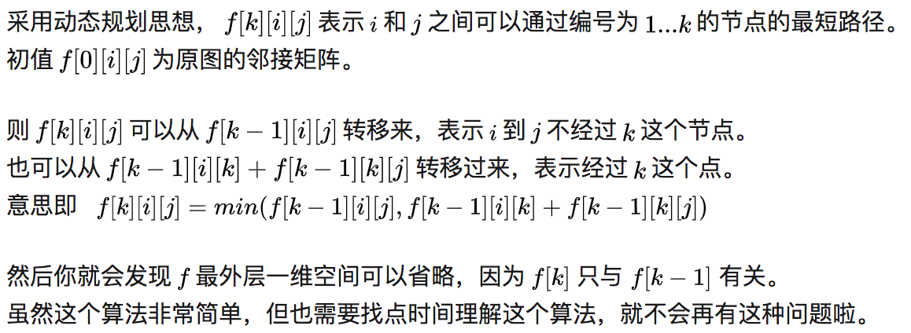

# Programming notes -- 201901

## 1. 20190115 dp优化穷举搜索问题

### 1.1 题目 [Exhaustive Search](http://judge.u-aizu.ac.jp/onlinejudge/description.jsp?id=ALDS1_5_A)

现有长度为n的数列A和整数m，编写程序判断A中任意几个元素相加是否能得到m。A中的每个元素只能使用一次。

### 1.2 穷举搜索

题中给定n小于20，因此可以暴搜出所有情况，判断是否要使用每一个数，复杂度$O(2^n)$

```c++
bool solve(int i, int m)
{
	if (m == 0)
	{
		return true;
	}
	if (i >= n)
	{
		return false;
	}
	bool res = solve(i + 1, m) || solve(i + 1, m - A[i]);
	return res;
}
```


### 1.3 dp优化

穷举搜索之所以低效是因为要重复计算已存在之结果，在本题中即`solve(i, m)`是否为true，如果能用一个数组将其记录下来，每次先查看当前数组`dp[i][m]`是否为true，可减少重复调用递归的次数。填满`dp[n][m]`需要mn次操作，因此复杂度$O(2^n)$. 将小规模局部问题的解存储在内存中，等到计算大的问题时直接拿来有效利用，这就是动态规划的基本思路。完整代码如下：

```c++
#include <cstdio>
#include <cstring>

int n, A[50], dp[21][2001];

int solve(int i, int m)
{
  if (dp[i][m] != -1)
  {
    return dp[i][m];
  }

  if (m == 0)
    dp[i][m] = 1;
  else if (i >= n)
    dp[i][m] = 0;
  else if (solve(i + 1, m))
    dp[i][m] = 1;
  else if (solve(i + 1, m - A[i]))
    dp[i][m] = 1;
  else
    dp[i][m] = 0;

  return dp[i][m];
}

int main()
{
  scanf("%d", &n);
  for (int i = 0; i < n; i++)
  {
    scanf("%d", &A[i]);
  }
  int q, m;
  scanf("%d", &q);
  for (int i = 0; i < q; i++)
  {
    memset(dp, -1, sizeof(dp));
    scanf("%d", &m);
    if (solve(0, m) != 0) printf("yes\n");
    else printf("no\n");
  }
  return 0;
}

```

# 2. 20190124 Floyd最短路径

Floyd最短路径依托的是关系

$dis[i][j] = min(dis[i][j], dis[i][k] + dis[k][j])$

将邻接矩阵中每个点的最短路都遍历出来，复杂度为$O(n^3)$.

模版例题 CityU126 (UVA567)

```c++
#include <cstdio>

int g[21][21];

int main()
{
  int n, kase = 1;
  while (~scanf("%d", &n))
  {
    for (int i = 0; i < 21; i++)
    {
      for (int j = 0; j < 21; j++)
      {
        g[i][j] = 10000;
      }
    }
    for (int i = 0; i < n; i++)
    {
      int tmp;
      scanf("%d", &tmp);
      g[1][tmp] = g[tmp][1] = 1;
    }
    for (int i = 2; i < 20; i++)
    {
      scanf("%d", &n);
      for (int j = 0; j < n; j++)
      {
        int tmp;
        scanf("%d", &tmp);
        g[i][tmp] = g[tmp][i] = 1;
      }
    }

    for (int k = 0; k <= 20; k++)
      for (int i = 0; i <= 20; i++)
        for (int j = 0; j <= 20; j++)
          if (g[i][k] + g[k][j] < g[i][j])
            g[i][j] = g[i][k] + g[k][j];

    int T;
    scanf("%d", &T);
    printf("Test Set #%d\n", kase++);
    while (T--)
    {
      int p1, p2;
      scanf("%d%d", &p1, &p2);
      printf("%2d to %2d: %d\n", p1, p2, g[p1][p2]);
    }
    printf("\n");
  }
}
```

利用dp的解释：[https://www.zhihu.com/question/30955032](https://www.zhihu.com/question/30955032)



